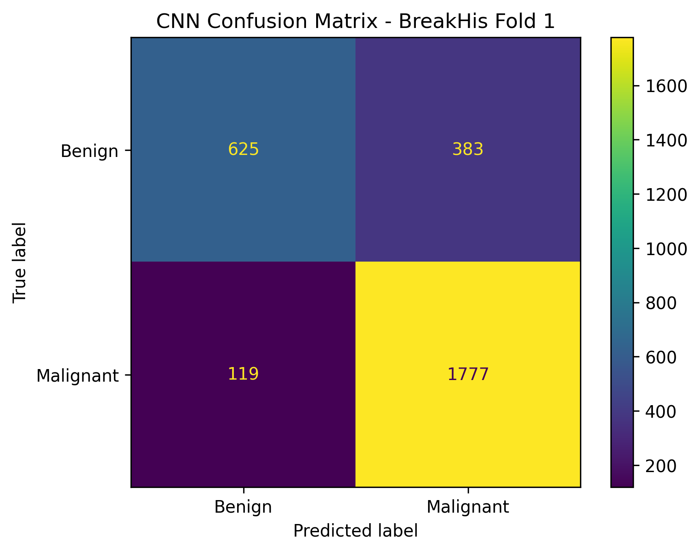

# Histopathology Image Classification Using Deep Learning | Python | TensorFlow | 2026

## Project Overview

This project develops a deep learning workflow for binary classification of histopathology images from the BreakHis dataset into benign and malignant categories.

The project uses image preprocessing and a Convolutional Neural Network (CNN) implemented with TensorFlow/Keras.

## Dataset

- Dataset: BreakHis
- Evaluation: Fold 1
- Test images: 2,904
- Classes:
  - Benign
  - Malignant
- Image size: 128 × 128 pixels

## Methodology

1. Loaded and organized histopathology images.
2. Resized images to 128 × 128 pixels.
3. Normalized pixel values to the range 0–1.
4. Used BreakHis Fold 1 for leakage-controlled evaluation.
5. Split the training portion into training and validation sets.
6. Developed a CNN for binary classification.
7. Evaluated the model using accuracy, precision, recall, and F1-score.

## CNN Architecture

- Conv2D — 32 filters
- MaxPooling2D
- Conv2D — 64 filters
- MaxPooling2D
- Conv2D — 128 filters
- MaxPooling2D
- Flatten
- Dense — 128 neurons
- Dropout — 0.5
- Output — Sigmoid

## Results

| Metric | Score |
|---|---:|
| Accuracy | 82.71% |
| Precision | 82.27% |
| Recall | 93.72% |
| F1-score | 87.62% |

### Confusion Matrix

| | Predicted Benign | Predicted Malignant |
|---|---:|---:|
| Actual Benign | 625 | 383 |
| Actual Malignant | 119 | 1,777 |

## Technologies

- Python
- TensorFlow
- Keras
- NumPy
- Pandas
- Scikit-learn
- Matplotlib

## Project Outputs

- Trained CNN model
- Confusion matrix
- Training and validation accuracy graph
- Training and validation loss graph
- Final evaluation results

## Disclaimer

This is a research and educational image-classification project using the BreakHis dataset. It is not a clinical diagnostic system.
## Confusion Matrix

README.md
confusion_matrix.png
training_validation_accuracy.png
training_validation_loss.png
